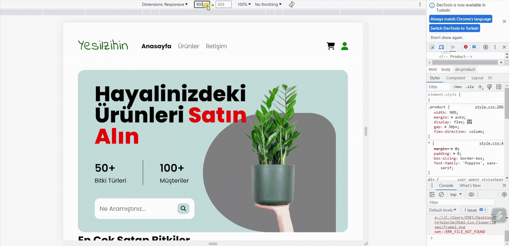

<h1>HTML CSS Responsive Flower Project</h1>

Bu proje, HTML ve CSS kullanılarak oluşturulan responsive bir web sitesini içermektedir. Projenin amacı, farklı ekran boyutlarına uyum sağlayan ve mobil cihazlarda da düzgün görüntülenen bir kullanıcı arayüzü sunmaktır.

<h2>Ekran</h2>

